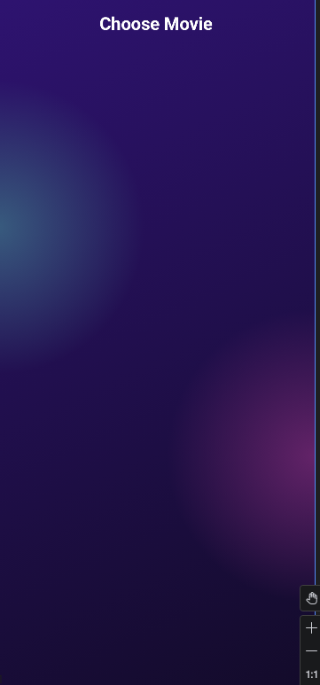
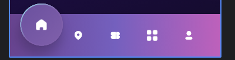

# 背景
## 渐变背景
### 1
**效果图**

```kotlin
modifier = Modifier  
    .fillMaxSize()  
    .background(  
        brush = Brush.linearGradient(  
            colors = listOf(  
                Color(46, 19, 112),  
                Color(19, 11, 42),  
            )  
        )  
    )  
    .background(  
        brush = Brush.radialGradient(  
            colors = listOf(  
                Color(56, 91, 126),  
                Color.Transparent  
            ),  
            center = Offset(0f, windowHeight / 3f),  
            radius = 500f  
        )  
    )  
    .background(  
        brush = Brush.radialGradient(  
            colors = listOf(  
                Color(158, 58, 166, 255),  
                Color.Transparent  
            ),  
            center = Offset(windowWidth, windowHeight / 3 * 2),  
            radius = 500f  
        )  
    )
```


### 2


---


# 底部导航栏
## 带有指示器动画
### 1
**效果图**


``` kotlin 
@Composable  
fun BottomBar() {  
    val bottomBarItemList by remember {  
        mutableStateOf(  
            listOf(  
                R.mipmap.nav_home,  
                R.mipmap.nav_location,  
                R.mipmap.nav_ticket,  
                R.mipmap.nav_category,  
                R.mipmap.nav_profile,  
            )  
        )  
    }  
    var selectedItemIndex by remember {  
        mutableIntStateOf(0)  
    }  
  
    BoxWithConstraints(  
        modifier = Modifier  
            .fillMaxWidth()  
            .height(80.dp)  
            .background(  
                brush = Brush.horizontalGradient(  
                    listOf(  
                        Color(104, 68, 144),  
                        Color(116, 96, 190),  
                        Color(190, 97, 187),  
                    )  
                )  
            )  
    ) {  
        maxWidth  
        val bottomBarItemWidth = 20.dp  
        val indicatorWidth = 80.dp  
        val chunkWidth = (maxWidth - bottomBarItemWidth * bottomBarItemList.size) / (bottomBarItemList.size + 1) + bottomBarItemWidth  
  
        val indicatorOffsetX by animateDpAsState(  
            targetValue = chunkWidth - bottomBarItemWidth/2 - indicatorWidth/2 + (chunkWidth * selectedItemIndex)  
        )  
  
        BottomBarIndicator(  
            modifier = Modifier  
                .size(indicatorWidth)  
                .offset(indicatorOffsetX, (-20).dp)  
                .align(Alignment.TopStart)  
        )  
  
        Row(  
            horizontalArrangement = Arrangement.SpaceEvenly,  
            verticalAlignment = Alignment.CenterVertically,  
            modifier = Modifier  
                .fillMaxWidth()  
                .align(Alignment.Center)  
        ) {  
            bottomBarItemList.forEachIndexed { index, item ->  
                BottomBarItem(  
                    icon = item,  
                    isSelected = index == selectedItemIndex,  
                    modifier = Modifier.size(bottomBarItemWidth),  
                ) {  
                    selectedItemIndex = index  
                }  
            }  
        }    }  
}  
  
@Composable  
fun BottomBarIndicator(modifier: Modifier = Modifier) {  
    Box(  
        modifier = modifier  
            .shadow(10.dp, shape = CircleShape)  
            .background(  
                brush = Brush.linearGradient(  
                    colors = listOf(  
                        Color(106, 80, 158),  
                        Color(128, 96, 171)  
                    )  
                ),  
                shape = CircleShape  
            )  
            .border(  
                width = 2.dp,  
                brush = Brush.linearGradient(  
                    colors = listOf(  
                        Color(153, 226, 241),  
                        Color(128, 96, 171),  
                        Color(128, 96, 171).copy(.3f),  
                    )  
                ),  
                shape = CircleShape  
            )  
    )  
}  
  
@Composable  
fun BottomBarItem(  
    icon: Int,  
    isSelected: Boolean,  
    modifier: Modifier = Modifier,  
    onClick: () -> Unit  
) {  
    val offestY by animateDpAsState(  
        targetValue = if (isSelected) (-20).dp else 0.dp,  
    )  
    Image(  
        painter = painterResource(icon),  
        contentDescription = null,  
        contentScale = ContentScale.Crop,  
        modifier = modifier  
            .offset(0.dp, offestY)  
            .clickNoRipple {  
                onClick()  
            }  
    )  
}
```