---
tags:
  - blender
---
# 视口

| 操作      | 快捷键             |
| ------- | --------------- |
| 平移      | shift+鼠标中键      |
| 旋转      | 鼠标中键            |
| 缩放      | 鼠标滚轮            |
| 全屏      | ctrl + 空格       |
| 大师全屏    | ctrl+alt+空格     |
| 新建工作区窗口 | 十字图标+shift+鼠标左键 |

# 工作区
| 操作         | 快捷键 |
| ---------- | --- |
| 右侧面板       | N   |
| 左侧工具栏      | T   |
| 快速聚焦物体     | .   |
| 大纲属性中定位选中项 | .   |
# 节点操作

## 连接线+连接点
Shift + 右键
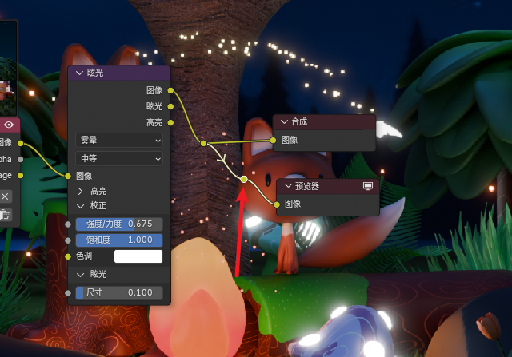


# 集合
* 选中物体，M新建集合

# 修改器类型
## 制作森林
使用 **==生成 -》 在表面上散步

## 物体线框逐渐绘制动画
线框+建形


## 藤蔓
线性修改器
叶子和主干构建父级关系（）


## 蒙皮修改器
- ctrl + a ：缩放点的半径


## 生成
### 线框
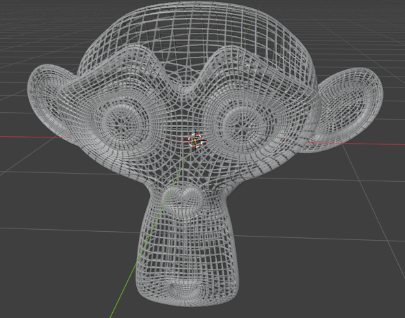

### 建形


# 物体模式

## 变换操作
应用变换：ctrl + a

## 操作面板
>操作完成后的数据面板->点击空白处消失->使用==F9==再次显示

## 移动
选中物体 -> G -> 鼠标移动
移动归零：alt + G
根据**轴**移动：z,x,y
根据**面**移动：shift + z,x,y

## 缩放
选中物体 -> S -> 鼠标移动
缩放归零：alt + S 


## 旋转
选中物体 -> R -> 鼠标移动
旋转归零：alt + R

## 镜像操作
选中物体 ->ctrl + M -> 轴向xyz

## 选择其他对象
ctrl + i -》选择剩余所有对象

## 隐藏其他对象
shift + h -》 隐藏其他对象
alt + h -》 显示其他对象


# 编辑模式

### 工具 
#### 视图着色方式
Z键 轮盘
透明模式：alt + Z 

### 视口
#### 吸附
alt + 鼠标中键移动视角，会自动吸附到正视图


## 对象操作

### 对象显示
/ & ？ 单独显示选中的对象，隐藏其他

### 3D游标
移动：shift + 鼠标右键 
重置：shift + C
设置游标方向：在设置->快捷键->3d游标->几何数据

### 变换操作
#### 移动 G
选中边-》G + G -》C 会沿方向拉伸
* G + G + 按住alt -》沿原本方向移动
* G + G +C -》沿原本方向移动

### 选择对象
#### 边
选择循环边：alt + 左键

倒角：ctrl + b |  鼠标滚轮添加数量

沿边拆面：alt + M   

#### 面
内插面：I

#### 折叠在一起的对象
alt + 左键 ：显示对象列表

### 复制对象
* shift + D -> 两个独立对象
* alt + D -> 两个关联对象

### 重复操作
shift + R -> 重复上一步操作


### 关联对象
**ctrl +L**
* 关联物体数据
* 复制修改器

#### 对象独立化
选中-> 工具栏物体 ->关系->独立化 -> 物体数据
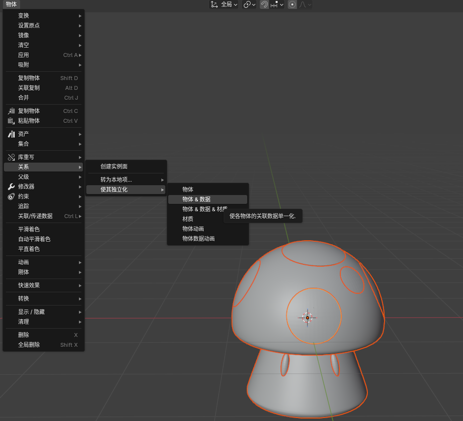

### 分离对象
P 分离选中项
V 分离选中线


### 选中关联的点线面
L关联的点线面


### 倒角
线倒角 ctrl + B
点倒角 shift + ctrl + B


### 挤出
alt + E -》 选择挤出方向

### 对象翻转
ctrl + M -》 选择轴向

### 拆分
alt + M 延边拆面

### 合并
M 按距离合并（解决原地挤出问题）

### 游标到选中项
shift + alt + s


### 内插面
- I：内插面
- I + I ：多个面一起内插，自己查自己 


---


## 线操作
- F：闭环（alt + c)
- alt+s：进行点的缩放


---

## 修改器操作

### 批量修改参数
选中多个物体 -> 使用==alt + 左键== -> 修改数据
将所有物体的这个修改器参数统一修改


## 摄像机
小键盘 数字0
home键 摄像机全屏
ctrl + alt + 0 移动摄像机到当前视角


# 雕刻

### 动态拓扑
自动生成线结构

### 笔刷设置

F + 移动 -》 笔刷大小
shift + F + 移动 -》笔刷强度

### 笔刷操作

ctrl + 左键 -》 凹陷
shift + 左键 -》 表面变平滑

### 重构网格
1. 关闭动态拓扑
2. R生成网格大小
3. 重构网格
	 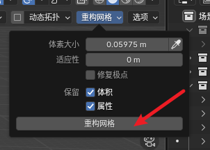


# 权重模式
设置定点组后会有权重
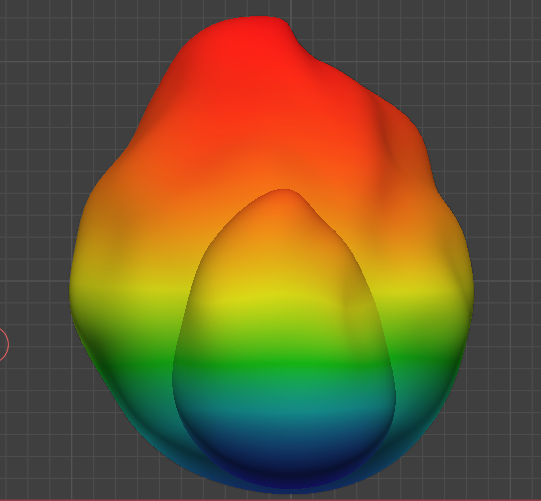

## 权重光滑
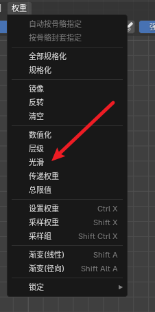
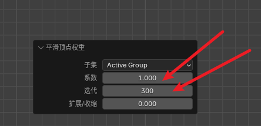


# 动画

## 形态键动画
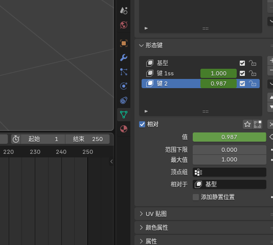


## 设置动画属性
```
#frame/100
```

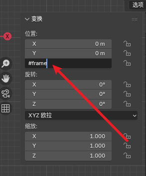

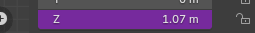

## 框线全部
~键，框线全部可以看到当前曲线的全部

## 动作编辑器

#### 循环部分动画
这个会从起始关键帧到结束关键帧循环
循环动作 -》选中对象-》通道-》外插模式-》使用循环
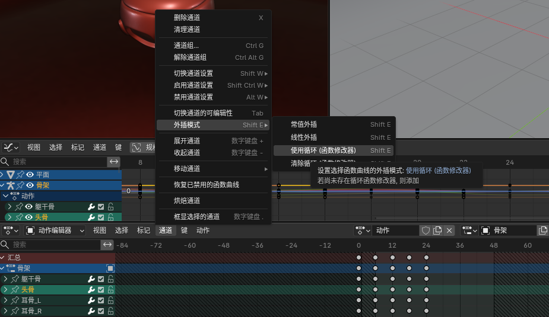


# 材质-着色器
- shift + p ： 框选

# 光照
## 世界光
- 背景节点
- 天空纹理
- 渐变纹理
- 环境纹理-》hdr贴图（exr后缀）
	- 渲染-》胶片里面取消背景
## 场景光


# 几何节点


# 骨架

## 骨骼
### 垂直缩放 v4.5
ctrl + shift + alt + s

### 骨骼快速重命名
F2


## 姿态


