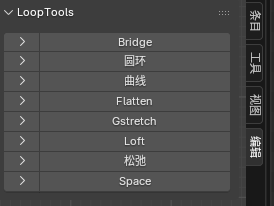
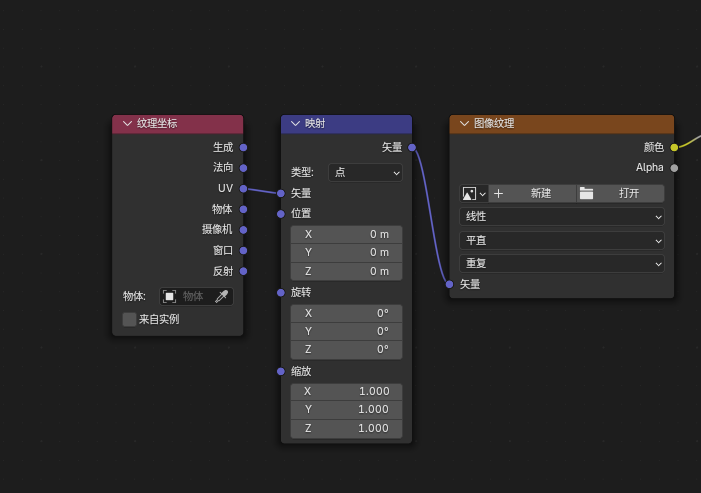
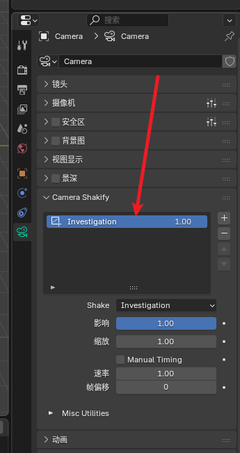
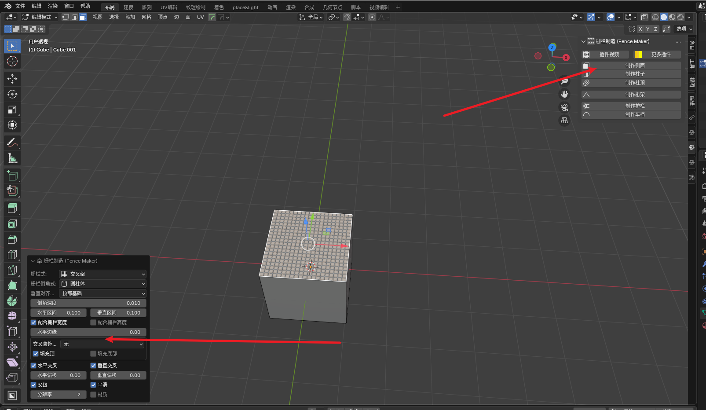
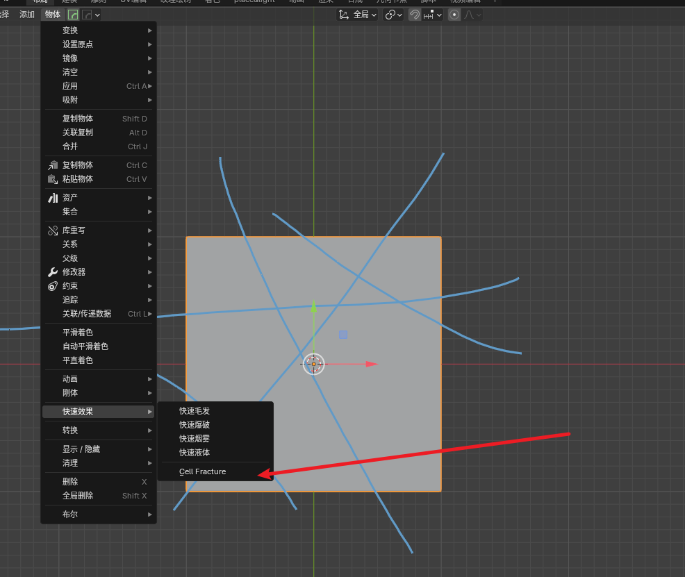

# LoopTools
圆环工具

# Node Wrangler
- Ctrl + T : 自动添加这3个节点
	
- Ctrl + Shift + LeftMouse节点：将节点连接到输出上
- Ctrl + Shift + T + BSDF：直接创建贴图，糙度，法向，置换
- Ctrl + Shift + 右键拖拉（两个BSDF）：创建混合着色器
- Alt + S ：混合节点上下交换
- 
 

# Bool Tool
- ctrl + -：减去相交
- ctrl + '+'：相加

# machin3 Tools(M3)
- F：拉进视图

# Camera Shakify
模拟相机走路

# Fence Maker
创造栅格
选中面，在侧边栏中进行生成

# Cell Fracture
将物体破碎
使用标记标注分割线
