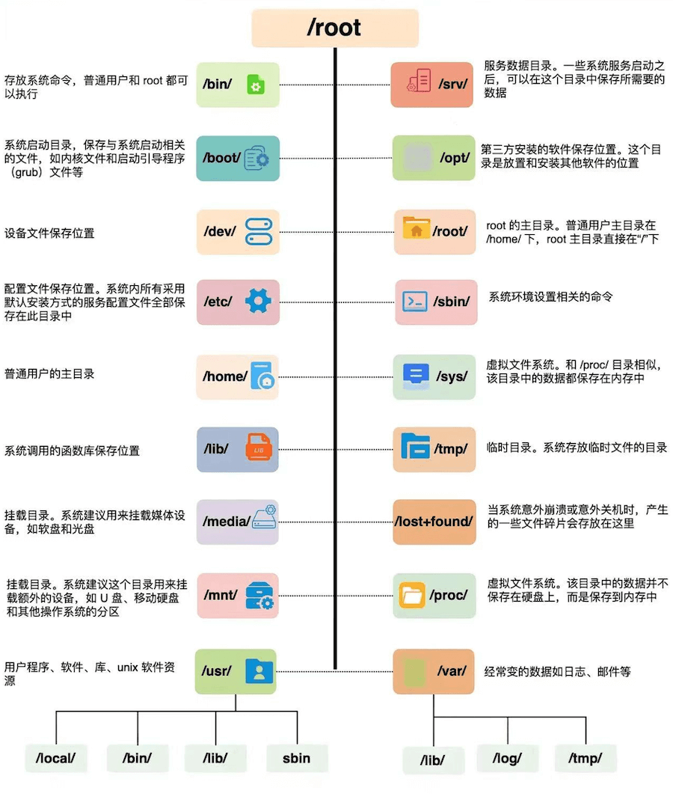
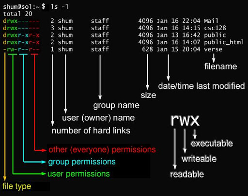

---
tags:
  - linux
---

## 基础
### 文件作用


### 配置全局命令
1. 打开全局 Bash 配置文件：

    ```bash
    sudo nano /etc/bash.bashrc
    ```
    
2. 滚动到文件底部，添加以下内容：
    ```bash
    # 为所有用户启用 ll 别名
    alias ll='ls -laF --color=auto'
    ```
    
3. 执行以下命令让配置立即在当前终端生效：
    ```bash
    source /etc/bash.bashrc
    ```


---

### 配置全局代理

1. 打开全局环境变量文件：(注：在 `/etc/profile.d/` 目录下新建 `.sh` 脚本是配置全局变量最规范、最易维护的方式)_
    ```bash
    sudo nano /etc/profile.d/proxy.sh
    ```

2. 写入以下内容

    ```

	# 这里的 IP 和端口请根据你的代理软件实际情况修改 
	export proxy="http://127.0.0.1:7890"
	
	export http_proxy="$proxy"                     
	export https_proxy="$proxy" 
	export ftp_proxy="$proxy"    
	
	# socks5 代理（如果你的代理支持 socks5，请取消下方注释并修改端口）                    
	# export all_proxy="socks5://192.168.1.100:7891"  
	
	# 排除不需要走代理的本地地址 
	
	export no_proxy="localhost,127.*,192.168.*,10.*,172.16.*,172.17.*,172.18.*,172.19.*,172.20.*,172.21.*,172.22.*,172.23.*,172.24.*,172.25.*,172.26.*,172.27.*,172.28.*,172.29.*,172.30.*,172.31.*"

    ```
    
3. 保存并退出，然后使其生效：
    ```
    source /etc/profile.d/proxy.sh
    ```

> 这里的配置对apt 和 docker pull没有作用
> [docker 加速 ](../docker/docker%20加速.md)


## 包管理工具

### apt

* **更新apt数据库**
	```bash
	sudo apt update
	```

* **升级已安装的软件包**
	```bash
	sudo apt upgrade
	# 完整升级（升级前先删除需要更新的软件包）
	sudo apt full-upgrade
	```

*  **安装指定的软件包**：
	```bash
	sudo apt install <package_name>
	sudo apt install <package_1> <package_2> <package_3>
	```

* **删除软件包**：
	```bash
	# purge删除 会将配置文件一起删除
	sudo apt remove <package_name>
	sudo apt purge <package_name>	
	```

* **查找软件包**：
	```bash
	sudo apt search <keyword>
	```

*  **显示软件包具体信息**：
	```bash
	sudo apt show <package_name>
	```

* **列出所有已安装的包**：
	```bash
	apt list --installed
	```

* **列出可更新的软件包**：
	```bash
	apt list --upgradable
	```

* **其他命令**
	```bash
	#清理不再使用的依赖和库文件**：
	sudo apt autoremove
	```


### dpkg
- 安装.deb软件
	```bash
	sudo dpkg -i *.deb
	# 如果有依赖问题
	sudo apt-get install -f
	
	# 可以使用apt管理
	sudo apt remove cc-switch
	```
- 查看一个包是否是apt安装的
	```bash
	 dpkg -l | grep docker
	```

## 用户管理
### 用户
- 添加用户
	- -c comment 指定一段注释性描述。
	- -m 创建用户主目录
	- -d 目录 指定用户主目录，如果此目录不存在，则同时使用-m选项，可以创建主目录。
	- -g 用户组 指定用户所属的用户组。
	- -G 用户组，用户组 指定用户所属的附加组。
	- -s Shell文件 指定用户的登录Shell。
	- -u 用户号 指定用户的用户号，如果同时有-o选项，则可以重复使用其他用户的标识号。
```bash
	#不加任何参数创建用户,会有一个同名group，没有创建home目录
	useradd wangzhe   
```
- 删除用户
	- -r 删除用户home目录
```bash
	userdel -r wangzhe 
	
```
- 修改用户
	- 参数=创建用户
```
	usermod [options] <用户名>
```
- 用户口令
	- -l 锁定口令，即禁用账号。
	- -u 口令解锁。
	- -d 使账号无口令。(无口令=不能登录)
	- -f 强迫用户下次登录时修改口令。
```bash
	passwd #修改当前用户密码
	passwd [用户名] #修改指定用户密码
```
- 查看所有用户
```bash
	# 查看/etc/passwd
	cat /etc/passwd
	#显示信息
	用户名:口令:用户标识号:组标识号:注释性描述:主目录:登录Shell
```
### 用户组
> 用户组的操作实际上是对`/etc/group`文件的更新
- 添加用户组
	- -g GID 指定新用户组的组标识号（GID）。
	- -o 一般与-g选项同时使用，表示新用户组的GID可以与系统已有用户组的GID相同。
```bash
	groupadd [options] <组名>
```

- 删除用户组
```
	groupdel <组名>
```
- 修改用户组
	- -g GID 为用户组指定新的组标识号。
	- -o 与-g选项同时使用，用户组的新GID可以与系统已有用户组的GID相同。
	- -n新用户组 将用户组的名字改为新名字
```bash
	groupmod 选项 用户组
```
- 切换用户组
	- 用户创建的文件会是当前切换的用户组
	- 用户当前用户组的权限
```bash
	# 不加组名，会切换到主用户组
	newgrp [组名]
	
```
- 用户组文件`/etc/group`
```bash
	组名:口令:组标识号:组内用户列表
```


### 权限

### sudo


## 系统管理
### 网络
#### 配置ip
- armbian：使用networkmanager（nmcli)
#### 配置网关
- ufw：简化操作，底层是iptables/nftables
- iptables: 老的网关
- nftables: 新一代网关，iptables继任者

##### ufw
> ufw底层是修改iptables规则
> 卸载ufw，会自动重置iptables
> 
- 开启端口
	```bash
	ufw allow 10001/tcp
	```
- 关闭端口
	```bash
	ufw deny 10001/tcp
	```
- 删除规则
	```bash
	ufw delete deny 10001/tcp
	```
- 查看规则
	```bash
	ufw status
	```
- 启动UFW
	```bash
	# 启动并设置开机启动
	ufw enable
	```
- 关闭ufw
	```bash
	# 关闭并设置取消开机启动
	ufw disable
	```


##### nftables
> nft默认是不会自动持久化，推荐直接编辑配置文件`/etc/nftables.conf`

- nft 配置保存
- 


### 文件

#### 文件属性
- 文件信息
	
- 修改所属用户
	```bash
	chown [–R] 所有者 文件名
	chown [-R] 所有者:属组名 文件名
	
	# ex
	chown bin a.txt
	chown bin:bin a.txt
	```
- 修改所属组
	```bash
	chgrp [-R] 属组名 文件名
	
	# ex
	chgrp root a.txt
	```
- 修改权限
	```bash
	# 数字修改
	# r:4,w:2,x:1
	# x:user,y:group,z:other
	chmod [-R] xyz 文件或目录
	chmod 770 a.txt
	
	# 符号类型(不好用)
	
	```

#### 文件操作

- ln:创建链接文件
	- 硬链接是同一个文件的同一个索引点的不同名字，删除其中几个不受影响。
	- 软连接类似于快捷方式，被链接文件丢失，导致链接失效，但链接任然存在。
	```bash
	ln a1 a2# 硬链
	ln -s a1 a3  # 软连
	```

- ls（英文全拼：list files）: 列出目录及文件名
	```bash
	ls -al
	```
- cd（英文全拼：change directory）：切换目录
- pwd（英文全拼：print work directory）：显示目前的目录
	```bash
	pwd
	pwd -P  #显示实际目录（不是链接目录）
	```
- mkdir（英文全拼：make directory）：创建一个新的目录
	```bash
	mkdir test
	mkdir -p a/b
	mkdir -m 777 test
	```
- rmdir（英文全拼：remove directory）：删除一个空的目录
	```bash
	rmdir test
	# 删除多级空目录
	rmdir -p a/b
	```
- cp（英文全拼：copy file）: 复制文件或目录
	- i  询问是否覆盖
	- r  复制的是目录，需要使用
	- 
	```bash
	
	cp [option] <source> <destion>
	
	# 如果destion 描述的目录存在，会复制到目录下，如果不存在，会修改为这个名字
	cp a b  # 当前目录没有目录b，a会重命名为b，如果b目录存在，b目录下会有一个文件a
	
	```
- rm（英文全拼：remove）: 删除文件或目录

	```bash
	 rm [-fir] 文件或目录
	```
	- -f ：就是 force 的意思，忽略不存在的文件，不会出现警告信息；
	- -i ：互动模式，在删除前会询问使用者是否动作
	- -r ：递归删除啊！最常用在目录的删除了！这是非常危险的选项！！！
- mv（英文全拼：move file）: 移动文件与目录，或修改文件与目录的名称
	```bash
	mv [-ifu] source destion
	# 如果最后一个层级目录如果不存在，就会将名称改为这个名称，如果存在，会移动到目标层级下面
	```

#### 查看文件
* cat : 从第一行开始查看
	```bash
	# 显示行号
	cat -n a.txt
	# 显示行号，不显示空行
	cat -b a.txt
	```
* tac： 从最后一行开始查看
* head: 查看前几行
* tail: 查看后几行
	```bash
	# 查看100行
	tail -n 100 a.txt
	
	# 持续监听数据，如果有新行，直接展示
	tail -nf 100 a.txt
	
	```
- more
- less

#### 文本编辑
##### vi/vim

##### nano
- ctrl + O : 保存文件，文件名修改=另存为
- ctrl + X：关闭文件
- ctrl + K: 剪切一行
- ctrl + U: 粘贴==`ctrl+K`==剪切的内容


### 进程

### 磁盘
#### df
df命令参数功能：==**检查文件系统**==的磁盘空间占用情况。可以利用该命令来获取硬盘被占用了多少空间，目前还剩下多少空间等信息

``` bash
df [-ahikHTm] [目录或文件名]
```
选项与参数：
- `-h`：以人类可读的方式显示输出结果（例如，使用 KB、MB、GB 等单位）。
- `-T`：显示文件系统的类型。
- `-t <文件系统类型>`：只显示指定类型的文件系统。
- `-i`：显示 inode 使用情况。
- `-H`：该参数是 `-h` 的变体，但是使用 1000 字节作为基本单位而不是 1024 字节。这意味着它会以 SI（国际单位制）单位（例如 MB、GB）而不是二进制单位（例如 MiB、GiB）来显示磁盘使用情况。
- `-k`：这个选项会以 KB 作为单位显示磁盘空间使用情况。
- `-a`：该参数将显示所有的文件系统，包括虚拟文件系统，例如 `proc`、`sysfs` 等。如果没有使用该选项，默认情况下，`df` 命令不会显示虚拟文件系统。
```bash
# 列出所有文件系统
df

# 显示这个目录使用的文件系统，-h:易读的方式
df -h /home

```

#### du（常用）
du 命令是对文件和目录磁盘使用的空间的查看
- -a ：列出所有的文件与目录容量，因为默认仅统计目录底下的文件量而已。
- -h ：以人们较易读的容量格式 (G/M) 显示；
- -s ：仅显示指定目录或文件的总大小，而不显示其子目录的大小。与-a互斥
- -S ：包括子目录下的总计，与 -s 有点差别。
- -k ：以 KBytes 列出容量显示；
- -m ：以 MBytes 列出容量显示；

```bash
du [-ahskm] 文件或目录名称

# 默认统计当前目录下所有子目录以及子孙目录的大小
du

# 显示文件及目录的大小
du -a

# 显示指定目录的大小
du -s
```


####  fdisk
fdisk 是 Linux 的磁盘分区表操作工具。

#### 看不懂，不常用，待学习

## 系统服务管理
使用ststemctl命令

### systemctl
- 查看服务状态
	```bash
	systemctl status <service name>
	```
- 停止服务
	```bash
	systemctl stop <service name>
	```
- 开启服务
	```bash
	systemctl start <service name>
	```
- 自启动服务
	```bash
	systemctl enable <service name>
	```
- 取消启动服务
	```bash
	systemctl disable <service name>
	```


### systemd-tmpfiles
`systemd-tmpfiles` 是 Linux 里专门负责**自动管理临时文件和目录**的服务。


## 其他命令

### curl
测试网络是否连通
```bash
curl -I http://google.com
```


### wget


### cron 定时任务
编辑定时任务
```bash
# 首次使用，需要选择编辑器vim/nano，修改后保存会直接生效
crontab -e
```

查看任务内容
```bash
crontab -l
```

